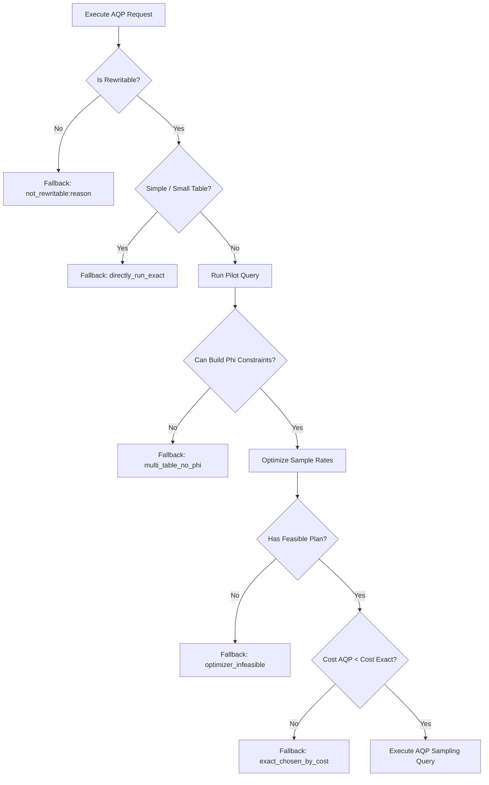

# PilotDB Fallback Mechanisms

This document outlines the fallback design, execution paths, and reporting conventions used when PilotDB resorts to running exact queries instead of approximate query processing (AQP).

## Overview

PilotDB aims to execute approximate queries using sampling to reduce resource utilization and run time. However, to guarantee accuracy and compliance with error budgets, the engine must fall back to running the exact query if sampling is either infeasible, unsafe, or more expensive.

The top-level query execution wrapper captures errors and converts failures into clean, structured records with specific fallback reasons.

---

## Fallback Execution Flow

When a query is dispatched to `execute_aqp`, the engine proceeds through several evaluation and validation phases:

---

## Detailed Fallback Reasons Mapping

The following table summarizes all potential `fallback_reason` values written to `all_results.jsonl` and returned in the timing dictionary.

| Fallback Reason | Description | Trigger Conditions |
| :--- | :--- | :--- |
| `directly_run_exact` | Exact query is run directly due to small table sizes or simple query structure. | Table cardinality is small or query has no joins/aggregations where sampling is beneficial. |
| `multi_table_no_phi` | Multi-table query lacks required constraints for AQP execution. | Failure to extract pilot block statistics or join statistics needed to compute error bounds under Lemma 4.8. |
| `not_rewritable:<detail>` | The query structure is not supported by the SQL rewriter. | E.g., `not_rewritable:subquery_placeholder` when subqueries cannot be parsed or safely transformed. |
| `optimizer_infeasible` | No sampling plan can satisfy the target error bounds within the maximum allowed sampling rate. | The optimizer checks candidate plans, and all plans fail to satisfy the $\Phi(\Theta)$ variance constraints at $\le 10\%$ sampling rate. |
| `sample_rate_too_high` | The solved sampling rate is too high. | The calculated sampling rate exceeds the maximum allowable threshold (e.g. $> 10\%$ or $> 100\%$). |
| `exact_chosen_by_cost` | Exact execution is cheaper than sampling. | The estimated cost of the selected sampling plan (including pilot overhead) exceeds the estimated cost of direct exact execution. |
| `pilot_sample_insufficient_units` | Insufficient data units in pilot results. | The pilot run returned fewer than 2 data units (pages/blocks), making variance estimation mathematically impossible. |
| `pilot_sample_degenerate_bounds` | Degenerate standard deviation. | Pilot variance estimation yields zero standard deviation on a non-trivial population, resulting in invalid math. |
| `solver_failed` | Rate optimization solver failed to converge. | The internal trust-region solver or SciPy bounds optimization fails to reach a mathematical solution. |
| `execute_aqp_recover` | Top-level uncaught exception handler rescue. | Any unexpected `Exception` raised during the AQP execution path (e.g. database connectivity loss or driver crashes). |

---

## Reporting Conventions & Schema

All query executions append a structured JSON log entry to `all_results.jsonl` with the following attributes:

* **`query`**: Name of the TPC-H query (e.g. `"q5"`, `"q7"`).
* **`dbms`**: Target database management system (e.g. `"duckdb"`, `"sqlserver"`, `"postgres"`).
* **`pilot_sample_rate`**: The sample rate used for the pilot run (expressed as a percentage/float).
* **`final_sample_rate`**: Set to `1` when exact fallback is triggered. Otherwise, the chosen sampling rate (e.g. `0.05`).
* **`fallback_reason`**: String code matching one of the legal fallback reasons. Set to `null` if the AQP sampling plan ran successfully.
* **`runtime`**: Timing metrics broken down by execution phase.
* **`fallback_cause`** *(Optional)*: If the fallback was triggered by an uncaught exception (`execute_aqp_recover`), this field logs the exception type and trace.
* **`variance_bound_note`** *(Optional)*: Set to `"variance_bound_violated"` if the query executed under an AQP sampling plan (no fallback) but the empirical error exceeded the target error limit.

